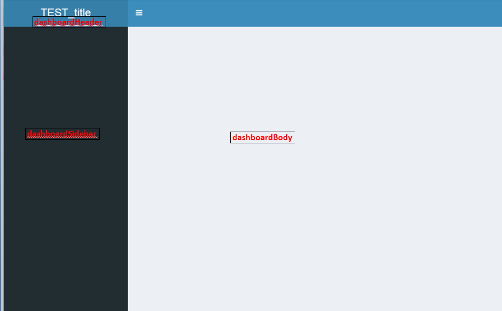

# Note : Markdown對於文字顏色支援並不充足，目前無法更換顏色

# 寫出大標題文字 : 
***
#### Markdown Script :
```
### 我是大標題
```
#### Markdown Result :
### 我是大標題

<br>


# 寫出文字段落:
***
#### Markdown Script :

```
### 引言
> 引言 : This is a blockquote with two paragraphs. Lorem ipsum dolor sit amet,
> consectetuer adipiscing elit. Aliquam hendrerit mi posuere lectus.
> Vestibulum enim wisi, viverra nec, fringilla in, laoreet vitae, risus.
```
#### Markdown Result :
### 引言 :
> 引言 : This is a blockquote with two paragraphs. Lorem ipsum dolor sit amet,
> consectetuer adipiscing elit. Aliquam hendrerit mi posuere lectus.
> Vestibulum enim wisi, viverra nec, fringilla in, laoreet vitae, risus.

<br>


# 無順序清單 :
***
#### Markdown Script :
```
* 無順序清單 1
* 無順序清單 2
* 無順序清單 3
```
#### Markdown Result :
* 無順序清單 1
* 無順序清單 2
* 無順序清單 3

<br>


# 有順序清單 (作法1) :
***
#### Markdown Script :
```
1. 有順序清單 1
2. 有順序清單 2
3. 有順序清單 3
```
#### Markdown Result :
1. 有順序清單 1
2. 有順序清單 2
3. 有順序清單 3

<br>


# 有順序清單 (作法2,以第一序號為主，即使後面錯碼也會逐漸加1) :
***
#### Markdown Script :
```
3. Bird
1. McHale
8. Parish
```
#### Markdown Result :
3. Bird
1. McHale
8. Parish

<br>


# 有順序清單 (作法3,以第一序號為主，即使後面同號碼也會逐漸加1) :
***
#### Markdown Script :
```
5. Bird
5. McHale
5. Parish
```
#### Markdown Result :
5. Bird
5. McHale
5. Parish

<br>


# 避免dot .與順序清單混淆，可在前面加\\斜線 :
***
#### Markdown Script :
```
1986. 我是順序清單.
1999. 我是順序清單.

1986\. 我只是一般文字.   
1999\. 我只是一般文字.
```
#### Markdown Result :
1986. 我是順序清單.
1999. 我是順序清單.

1986\. 我只是一般文字.   
1999\. 我只是一般文字.

<br>


# 引言中加大標題及清單 :
***
#### Markdown Script :
```
> ###引言中段落大標題 : 
> 1.  清單1
> 2.  清單2
```
#### Markdown Result :
> ###引言中段落大標題 : 
> 1.  清單1
> 2.  清單2

<br>


# 標記灰底區 :
***
#### Markdown Script :
```
灰底區在右邊喔 `我是灰底區 printf()` 左邊是灰底區.
```
#### Markdown Result :
灰底區在右邊喔 `我是灰底區 printf()` 左邊是灰底區.

<br>


# 於\`符號內標記灰底區 :
***
#### Markdown Script :
```
A single backtick in a code span: `` ` ``

A backtick-delimited string in a code span: `` `foo` ``
```
#### Markdown Result :
A single backtick in a code span: `` ` ``

A backtick-delimited string in a code span: `` `foo` ``

<br>


# 引言中加程式碼區塊 (成功/失敗例子皆有) :
***
#### Markdown Script :
```
> 成功 example code:(前方需兩個tab)
> 
>     程式碼區塊return shell_exec("echo $input | $markdown_script");

> 失敗 example code:(前方無兩個tab)
>
> 失敗的程式碼區塊return shell_exec("echo $input | $markdown_script");
```
#### Markdown Result :
> 成功 example code:(前方需兩個tab)
> 
>     程式碼區塊

> 失敗 example code:(前方無兩個tab)
>
> 失敗的程式碼區塊

<br>


# 引言中又引言 :
***
#### Markdown Script :
```
> 區塊引言
>
> > 區塊引言中引言
```
#### Markdown Result :
> 區塊引言
>
> > 區塊引言中引言

<br>


# 分順序清單並於清單內分多個段落 :
***
#### Markdown Script :
```
1.  This is a list item with two paragraphs. Lorem ipsum dolor
    sit amet, consectetuer adipiscing elit. Aliquam hendrerit
    mi posuere lectus.

    Vestibulum enim wisi, viverra nec, fringilla in, laoreet
    vitae, risus. Donec sit amet nisl. Aliquam semper ipsum
    sit amet velit.

2.  Suspendisse id sem consectetuer libero luctus adipiscing.
```
#### Markdown Result :
1.  This is a list item with two paragraphs. Lorem ipsum dolor
    sit amet, consectetuer adipiscing elit. Aliquam hendrerit
    mi posuere lectus.

    Vestibulum enim wisi, viverra nec, fringilla in, laoreet
    vitae, risus. Donec sit amet nisl. Aliquam semper ipsum
    sit amet velit.

2.  Suspendisse id sem consectetuer libero luctus adipiscing.

<br>


# 分無順序清單並於清單內加引言 :
***
#### Markdown Script :
```
*   A list item with a blockquote:

    > This is a blockquote
    > inside a list item.
```
#### Markdown Result :
*   A list item with a blockquote:

    > This is a blockquote
    > inside a list item.
    
<br>


# 程式碼區塊 方式1 需前面加兩個tab :  
***
#### Markdown Script :
```
下方出現程式碼區塊喔:

    我在程式區塊內喔  
    
Here is an example of R Script:

    library(car)
    cat("Hello, I hate GG")   
```
#### Markdown Result :
下方出現程式碼區塊喔:

    我在程式區塊內喔  
    
Here is an example of R Script:

    library(car)
    cat("Hello, I hate GG")   
    
<br>


# 程式碼區塊 方式2 前後以\`\`\`包住 :
***
#### Markdown Script :
```
下方出現程式碼區塊喔:
 ```
 我在程式區塊內喔
 ```
 Here is an example of R Script:
 ```r
 library(car)
 cat("Hello, I hate GG") 
 ``` 
```    
#### Markdown Result :
下方出現程式碼區塊喔:
```
我在程式區塊內喔
```
Here is an example of R Script:
```r
library(car)
cat("Hello, I hate GG") 
```

<br>


# 加入分割線 :
***
#### Markdown Script :
```
以下4種語法分割線樣式皆相同
* * *

***

*****

- - -
```
#### Markdown Result :

* * *

***

*****

- - -

<br>


# 於文字敘述中嵌入圖片超連結 (雙引號前不加驚嘆號!把欲超連結的文字包起來即可,圖片自動指定同folder底下的位置) :
***
#### Markdown Script :
```
This is an example [image](dashboard_01.png) inline link.
```
#### Markdown Result :
This is an example [image](dashboard_01.png) inline link.

<br>


# 單純嵌入圖片不要文字,雙引號前加驚嘆號!不加文字包起來即可 (圖片自動指定同folder底下的位置) :
***
#### Markdown Script :
```

```
#### Markdown Result :


<br>


# 文字上方單純嵌入圖片,雙引號前加驚嘆號!加文字包起來即可 (圖片自動指定同folder底下的位置) :
***
#### Markdown Script :
```

```
#### Markdown Result :


<br>


# 於文字敘述中嵌入網址超連結, 作法1 (雙引號前不加驚嘆號!把欲超連結的文字包起來即可,往址自動指定同folder底下的位置) :
***
#### Markdown Script :
```
This is an example [URL](http://yahoo.com.tw "我是滑鼠移向連結會秀出的文字") inline link.
```
#### Markdown Result :
This is an example [URL](http://yahoo.com.tw "我是滑鼠移向連結會秀出的文字") inline link.

<br>


# 於文字敘述中嵌入網址超連結, 作法2 (雙引號前不加驚嘆號!把欲超連結的文字包起來即可,往址自動指定同folder底下的位置) :
***
#### Markdown Script :
```
This is an example [URL] [id] inline link.
```
#### Markdown Result :
[id]: http://yahoo.com.tw  "我是滑鼠移向連結會秀出的文字"

<br>


# 文字強調寫法 :
***
`Markdown使用星號（*）和底線（_）作為標記強調字詞的符號，被*或_包圍的字詞會被轉成用<em>標籤包圍，用兩個*或_包起來的話，則會 被轉成<strong>`

#### Markdown Script :
```
*single asterisks*

_single underscores_

**double asterisks**

__double underscores__
```
#### Markdown Result :
*single asterisks*

_single underscores_

**double asterisks**

__double underscores__

<br>


# 文字自帶連結功能 :
***
#### Markdown Script :
```
<http://example.com/>
```
#### Markdown Result :
<http://example.com/>

<br>


# 跳脫字元
***
`Markdown可以利用反斜線 \ 來插入一些在語法中有其他意義的符號，例如：如果你想要用星號加在文字旁邊的方式來做出強調效果（但不用<em>標籤），你可以在星號的前面加上反斜線 \`

#### Markdown Script :
```
\*literal asterisks\*
```
#### Markdown Result :
\*literal asterisks\*

<br>


# Markdown支援下面符號前面加上反斜線 \\ 來幫助插入普通的符號：
***
```
\   反斜線
`   反引號
*   星號
_   底線
{}  大括號
[]  方括號
()  括號
#   井字號
+	加號
-	減號
.   英文句點
!   驚嘆號
```

<br>


# 表格
***
#### Markdown Script :
```
冒號（Colons）是用來對齊的（擺左齊左、擺右齊右，都擺就置中）
| Tables        | Are           | Cool  |
| ------------- |:-------------:| -----:|
| col 3 is      | right-aligned | $1600 |
| col 2 is      | centered      |   $12 |
| zebra stripes | are neat      |    $1 |

最外圍的豎線（|）不是絕對需要，在原始文檔中你可以不要太在意美觀，實際轉成網頁或電子書時會呈現得很好。你也可以在表格內使用行內格式。
Markdown | Less | Pretty
--- | --- | ---
*Still* | `renders` | **nicely**
1 | 2 | 3
```
#### Markdown Result :
| Tables        | Are           | Cool  |
| ------------- |:-------------:| -----:|
| col 3 is      | right-aligned | $1600 |
| col 2 is      | centered      |   $12 |
| zebra stripes | are neat      |    $1 |

Markdown | Less | Pretty
--- | --- | ---
*Still* | `renders` | **nicely**
1 | 2 | 3

<br>


